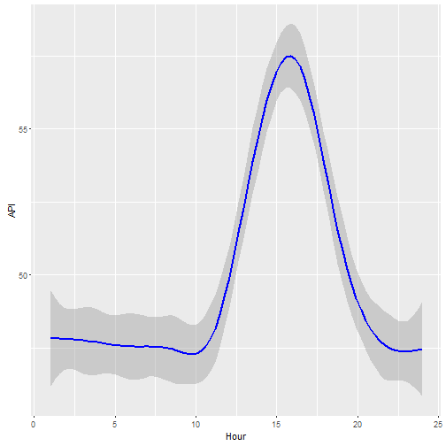

Module9 Developing Data Products Project - Part2
========================================================
author: Pete Siau
date: 30 January 2016

Introduction
========================================================

This is the second part for the course project for **Module 9 - Developing Data Products**. The purpose is to create a *reproducible* presentation platform to present the first part of the course project which is a Shiny application. It was: 1) created using Rstudio Presenter, 2) contains 5 pages, 3) hosted on Rpubs, and 4) contains some embedded R code that gets run when slidifying the document.

The source code for this **_R Presentation_** is available at:

<https://github.com/petesiau/Developing_Data_Product_Presentation>


The Shiny Application
========================================================

The Shiny application is the first part of the Course Project which is to display the Air Pollutant Index (API) for the **Banting** town area in Malaysia. It is avalilable at:

<http://petesiau.shinyapps.io/Developing_Data_Products>

The source code files (ui.R and server.R) and data file (API_Banting.csv) are available on the GitHub repository below:

<https://github.com/petesiau/Developing_Data_Products>


Slide With Code
========================================================


```r
dataAPI <-read.csv("API_Banting.csv")
summary(dataAPI)
```

```
   Station.No    Location             Date            Hour      
 Min.   :41   Banting:13296   2013-08-01:   24   Min.   : 1.00  
 1st Qu.:41                   2013-08-02:   24   1st Qu.: 6.75  
 Median :41                   2013-08-03:   24   Median :12.50  
 Mean   :41                   2013-08-04:   24   Mean   :12.50  
 3rd Qu.:41                   2013-08-05:   24   3rd Qu.:18.25  
 Max.   :41                   2013-08-06:   24   Max.   :24.00  
                              (Other)   :13152                  
      API         Pollutant
 Min.   :  0.00   *:10855  
 1st Qu.: 38.00   0:  567  
 Median : 49.00   a:   32  
 Mean   : 49.82   c: 1842  
 3rd Qu.: 59.00            
 Max.   :323.00            
                           
```


Slide With Plot
========================================================


```r
library(ggplot2)
dataAPI <-read.csv("API_Banting.csv")
ggplot(data=dataAPI, aes(x=dataAPI$Hour, y=dataAPI$API))+geom_smooth(color="blue")+labs(x="Hour", y="API")
```


